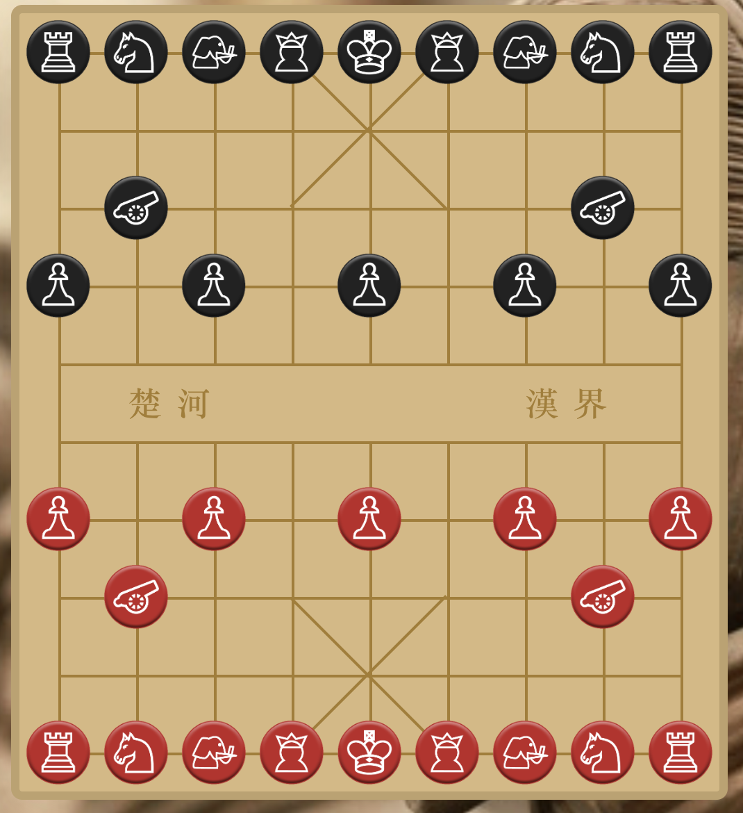

# Xiangqi (Chinese Chess) with AI

This project is a web-based Xiangqi (Chinese Chess) application that allows users to play against different AI opponents. It features a modern, clean interface and a decoupled front-end and back-end architecture.

{: width="400px"}

## Features

- **Play Xiangqi**: A fully functional Xiangqi board with all standard rules implemented.
- **Selectable AI Opponents**: Choose to play against different AI agents with varying difficulty.
  - **Random Agent**: A simple agent that makes random legal moves.
  - **Minimax (Expert) Agent**: A more advanced agent using Minimax search with Alpha-Beta Pruning, Iterative Deepening, and a heuristic evaluation function with Piece-Square Tables.
- **Modern UI**: A clean, responsive user interface built with React.
- **Separated Frontend/Backend**: A robust architecture that separates the user interface (React) from the game logic and AI (Python/FastAPI).

## Technology Stack

- **Frontend**:
  - [React](https://reactjs.org/)
  - [TypeScript](https://www.typescriptlang.org/)
  - Vite
- **Backend**:
  - [Python](https://www.python.org/)
  - [FastAPI](https://fastapi.tiangolo.com/)
  - Uvicorn

## Project Structure

The project is organized into two main directories:

- `/front-end`: Contains the React/TypeScript user interface.
- `/back-end`: Contains the Python/FastAPI server, which hosts the game logic and AI agents.

## Getting Started

To run the project locally, you will need to start both the back-end server and the front-end application.

### 1. Running the Backend

First, navigate to the back-end directory and set up the Python environment.

```bash
cd back-end

# It is recommended to create a virtual environment
python -m venv .venv
source .venv/bin/activate  # On Windows, use `.venv\Scripts\activate`

# Install dependencies
pip install -r requirements.txt

# Run the server
uvicorn main:app --reload
```
The back-end server will be running on `http://127.0.0.1:8000`.

### 2. Running the Frontend

In a separate terminal, navigate to the front-end directory.

```bash
cd front-end

# Install dependencies
npm install

# Run the development server
npm run dev
```
The front-end application will be available at `http://localhost:5173` (or another port if 5173 is busy). Open this URL in your browser to play the game. 